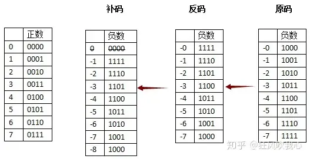

# 01 计算机语言绪论

## 一、计算机语言的发展和演变
程序是指令的集合，指令是计算机可执行的命令  
1. 机器语言：计算机可直接读取机器语言，但其与人类语言区别大，难度高
2. 汇编语言：将一些机器指令映射为可读懂的助记符，进步在于创造了汇编程序，但仍与人类思维相差太远
3. 高级语言：屏蔽了机器的细节，提高了语言的抽象层次，缺点在于程序中数据和操作不能分离
4. 面向对象语言：通过抽象出客观事物的共有行为和属性形成类，大大提高了代码效率

## 二、面向对象
### 2.1 面向对象思想
面向过程将问题拆解为多个步骤，采用结构化的设计思路，每个功能单独封装。其假设问题解决的过程是不变的，所以其在数据结构发生变化时每个功能都需要修改，修改成本高。
面向对象则将数据与操作封装在一起，通过api的方式与外界发生联系。
### 2.2 面向对象的语言
1. Smalltalk是第一个真正的面向对象的语言
2. C++语言在C语言的基础上扩充，是应用最广的面向对象语言

## 三、进制与编码
### 3.1 进制转换
1. R进制转十进制：数值x位权 $(abcd.ef)_R=aR^3+bR^2+cR^1+dR^0$
2. 十进制转R进制:  
整数部分
小数部分
### 3.2 编码
#### 3.2.1 原码
表示规则：用最高位表示符号，其他位存放该数二进制绝对值
+3：0011   -3：1011
+3-3=0011+1011=1100=-6  
**问题：**  
1. 0有+0和-0两种表示形式，需要将-0手动调成+0  
2. 加减法运算要先判断符号，非常复杂（否则出现+3-3=-6）
#### 3.2.2 反码
表示规则：正数的反码就是原码，负数的反码是符号位外，按位取反
解决了异号加法的问题  

|  | 原码 | 反码 |
| --- | --- | --- |
| +3 | 0011 | 0011 |
| -3 | 1011 | 1100 |

反码：（+3）+（-3）=1111-->原码:1000=-0  
**问题：**  
1. 两个负数相加会出现问题（比真实值小1）  
2. 数值0仍然有两种表示方法
#### 3.2.3补码
计算规则：模数-真实值（与之互补的一个数）：$-k = 2^n-|k|$  
模数：是某种计量器的容量。n位整数，它的模数就是$2^n$  
**思想：**
当进行一个循环的操作时，减去一个数也可以等于加上一个它的同余数（反正超出的部分会循环），循环的最大值成为模。
> 如果说现在时针现在停在10点钟，那么什么时候会停在八点钟呢？
> 简单，过去隔两个小时的时候是八点钟，未来过十个小时的时候也是八点钟。
也就是说时间倒拨2小时，或正拨10小时都是八点钟。
也就是10-2=8，而且10+10=8。
这个时候满12，说明时针在走第二圈，又走了8小时，所以时针正好又停在八点钟。

  
补码的本质：
补码解决的是混合编码的问题，原码表示负数时，第一位是码制，其余是数制，这是一种混合编码，无法进行数学运算。
补码编码实质上将第一位的权重调整，

负数补码的计算：每位取反+1

## 四、信息存储
### 4.1 存储长度
位bit：表示一个二进制信息（0或1）
字节Byte：一字节由8位二进制数字组成（1Byte=8bit）
1KB=1024B, 1MB=1024KB, 1GB=1024MB
字长Word：
### 4.2 浮点数的存储
三篇非常好的讲解：  
[IEEE754标准: 一 , 浮点数在内存中的存储方式](https://zhuanlan.zhihu.com/p/343033661)  
[IEEE754标准: 二, 32位浮点数的取值范围](https://zhuanlan.zhihu.com/p/343037540)  
[IEEE754标准: 三, 为什么说32位浮点数的精度是“7位有效数”](https://zhuanlan.zhihu.com/p/343040291)  

