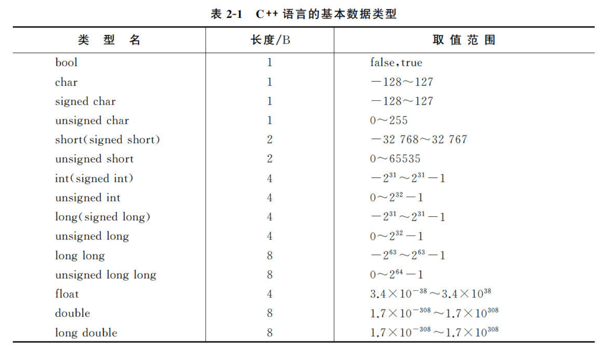
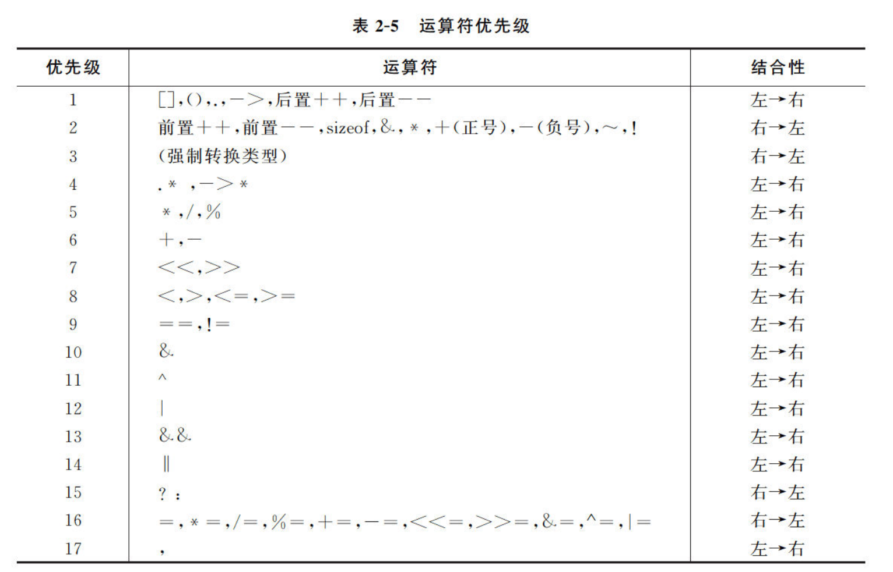
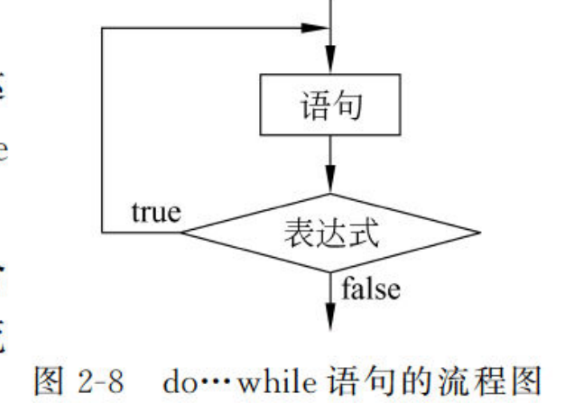
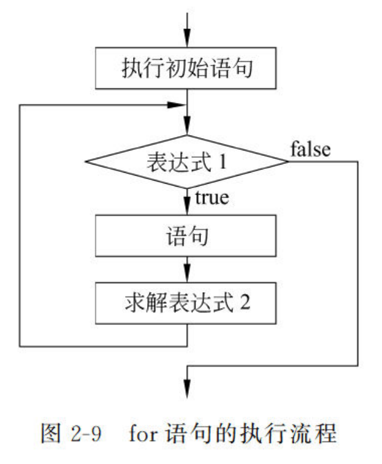

# 02 C++语言基础
## 一、数据类型

unsigned, signed, short, long被称为修饰符

### 1.1 bool类型
bool类型，true时存放1，false时存放0
### 1.2 字符与字符串
C++中没有字符串常量，一般利用字符型数组来存储，也可引入string类。
注意：单引号表示字符，双引号表示字符串
```cpp
char str1 = 'a'; //char只有一个长度，存储一个字符
char str2[] = "abcd"; //实际存储内容为['a','b','c','d','\0']
char str3[5] = "abcd"; //和str2等价，但不得使用str3[4]这种长度不足的写法
```
**string类：C++标准库模板**

1. 拥有众多的成员函数，对字符串进行操作，同名函数有多个重载
2. 有多种构造函数，赋值方法，可通过length, size函数求长度
3. 对于操作字符串，有+，append运算符进行字符串连接；有compare比较字符串；有求子串、查找子串的方法
### 1.3 浮点型float和double
double的精度高于float，float有6，7位有效位，double有15，16位
float占据32位内存，double占用64位内存
浮点数的比较：谨慎直接用等号
具体参见上一章：01计算机语言绪论 4.2节  
### 1.4 不同类型数值运算

### 1.5 数组
数组是具有一定顺序关系的若干对象的组合体，每个元素有n个下标的称为n维数组
#### 1.5.1 数组的声明
`数据类型 标识符[常量表达式1][常量表达式2]...`

1. 除了void类型，其他基本数据类型都可以声明数组
2. 标识符为数组的名称
3. 常量表达式必须为正整数

int a [2][3]，访问最后的值是a[1][2]，因为下标从0开始。
#### 1.5.2 数组的初始化
```cpp
int a[3] = {1,1,1} //a[0]a[1]a[2]的值都是1
int a [] = {1,1,1} //与上一句等价

int b[5]={1,2,3} //合法，b[0]b[1]b[2]被赋值为1，2，3，b[4],b[5]默认赋值为0
int b[5] //合法，但是数组的初始值不确定，不一定为0

int c[][5] = {1,1,1,1,1} //合法，会自动判断第一个常量表达式的值

const d[5] = {1,2,3} //声明为常量的数组，必须给定初值

```
#### 1.5.3 数组传参
使用数组元素作为实参，与其他情况无区别。使用数组名作为实参，传递的是地址，也就是引用传递，会直接操作原地址数据。

## 二、常量与变量
### 2.1 常量
分类：整型常量，实型常量，布尔常量，字符常量，字符串常量
利用const关键字定义，常量不会被更新
Differences between using const and #define:
> The #define directive is a **preprocessor** directive; the preprocessor replaces those macros by their body _before_ the compiler even sees it. Think of it as an automatic search and replace of your source code.
> A const variable declaration declares an actual variable in the language, which you can use... well, like a real variable: take its address, pass it around, use it, cast/convert it, etc.
There's about no difference on performance.

const会被作为变量处理，#define是直接替换程序内的关键字，所以const会更为可靠
const默认为文件内局部变量，跨文件使用需要声明extern const

### 2.2 变量
#### 2.2.1 声明和定义
C++中，大多数情况中声明变量就完成了定义
不同于python，**类型和名称**都要声明。  
**合法的变量名标识符：**

1. 以大写字母，小写字母和下划线或数字0-9开始
2. 不能是关键字或操作符（否则引发重载）
#### 2.2.2 变量的初始化：
C++中定义一个变量时，必须先对其进行初始化
```cpp
//整型变量初始化
int a = 0；int a(0)；//前两种使用条件宽松
int a = {0}；int a{0}；//后两种被称为列表初始化，使用条件严格，不允许信息丢失
int a{1.41}； //错误，无法执行
int a = 1.41 //可执行，初始化a=1
```
## 三、运算符
### 3.1 算数运算符
| 运算符 | 描述 | 实例 |
| --- | --- | --- |
| + | 把两个操作数相加 | A + B 将得到 30 |
| - | 从第一个操作数中减去第二个操作数 | A - B 将得到 -10 |
| * | 把两个操作数相乘 | A * B 将得到 200 |
| / | 分子除以分母 | B / A 将得到 2 |
| % | 取模运算符，整除后的余数 | B % A 将得到 0 |
| ++ | [自增运算符](https://www.runoob.com/cplusplus/cpp-increment-decrement-operators.html)，整数值增加 1 | A++ 将得到 11 |
| -- | [自减运算符](https://www.runoob.com/cplusplus/cpp-increment-decrement-operators.html)，整数值减少 1 | A-- 将得到 9 |

**++a和a++的区别：先自增再操作还是先操作再自增**
```cpp
int a = 30,b=0,c=0;
b=a++;
c=++a;
//此时，a=32,b=30,c=32
```
### 3.2 关系运算符
| 运算符 | 描述 | 实例 |
| --- | --- | --- |
| == | 检查两个操作数的值是否相等，如果相等则条件为真。 | (A == B) 不为真。 |
| != | 检查两个操作数的值是否相等，如果不相等则条件为真。 | (A != B) 为真。 |
| > | 检查左操作数的值是否大于右操作数的值，如果是则条件为真。 | (A > B) 不为真。 |
| < | 检查左操作数的值是否小于右操作数的值，如果是则条件为真。 | (A < B) 为真。 |
| >= | 检查左操作数的值是否大于或等于右操作数的值，如果是则条件为真。 | (A >= B) 不为真。 |
| <= | 检查左操作数的值是否小于或等于右操作数的值，如果是则条件为真。 | (A <= B) 为真。 |

### 3.3 逻辑运算符
| 运算符 | 描述 | 实例 |
| --- | --- | --- |
| && | 称为逻辑与运算符。如果两个操作数都 true，则条件为 true。 | (A && B) 为 false。 |
| &#124;&#124; | 称为逻辑或运算符。如果两个操作数中有任意一个 true，则条件为 true。 | (A &#124;&#124; B) 为 true。 |
| ! | 称为逻辑非运算符。用来逆转操作数的逻辑状态，如果条件为 true 则逻辑非运算符将使其为 false。 | !(A && B) 为 true。 |

**&&和||的短路特性：**  
1. &&第一个表达式的值为false时，其余表达式不再运行  
2. ||第一个表达式的值为true时，其余表达式不再运行

### 3.4 位运算符（按位进行操作）
| 运算符 | 描述 | 实例 |
| --- | --- | --- |
| & | 按位与操作，按二进制位进行"与"运算。运算规则：
0&0=0;    0&1=0;     1&0=0;      1&1=1; | (A & B) 将得到 12，即为 0000 1100 |
| &#124; | 按位或运算符，按二进制位进行"或"运算。运算规则：
0&#124;0=0;    0&#124;1=1;    1&#124;0=1;     1&#124;1=1; | (A &#124; B) 将得到 61，即为 0011 1101 |
| ^ | 异或运算符，按二进制位进行"异或"运算。运算规则：
0^0=0;    0^1=1;    1^0=1;   1^1=0; | (A ^ B) 将得到 49，即为 0011 0001 |
| ~ | 取反运算符，按二进制位进行"取反"运算。运算规则：
~1=-2;    ~0=-1; | (~A ) 将得到 -61，即为 1100 0011，一个有符号二进制数的补码形式。 |
| << | 二进制左移运算符。将一个运算对象的各二进制位全部左移若干位（左边的二进制位丢弃，右边补0）。 | A << 2 将得到 240，即为 1111 0000 |
| >> | 二进制右移运算符。将一个数的各二进制位全部右移若干位，正数左补0，负数左补1，右边丢弃。 | A >> 2 将得到 15，即为 0000 1111 |

### 3.5 运算符优先级与结合性：

### 3.6 混合运算时的数据类型转换
二元运算符一般要求两个操作数的类型一致
#### 3.6.1 隐式转换：
原则：向精度更高的，长度更长的转化  
特点：转换是安全的，过程中数据的精度没有损失  
例：两数中一个是long double则另一个也转换为long double
#### 3.6.2 赋值转换：
当进行赋值运算时，右值会被自动转化为左值的类型  
例：整型i = 浮点型m，则i只取m的整数部分，小数部分精度丢失
#### 3.6.3 显式转换：
特点：可能是不安全的，将高类型数据向低类型转换时，精度会丢失

| 关键字 | 说明 |
| --- | --- |
| static_cast | 用于良性转换，一般不会导致意外发生，风险很低。 |
| const_cast | 用于 const 与非 const、volatile 与非 volatile 之间的转换。 |
| reinterpret_cast | 高度危险的转换，这种转换仅仅是对二进制位的重新解释，不会借助已有的转换规则对数据进行调整，但是可以实现最灵活的 C++ 类型转换。 |
| dynamic_cast | 借助 RTTI，用于类型安全的向下转型（Downcasting）。 |

语法`static_cast<newType>(data)`
## 四、选择结构，循环结构
### 4.1 选择结构switch
```cpp
#include <iostream>
using namespace std;

int main() {
	int day;
	cin >> day;
	switch (day) {
	case 0:
		cout << "Sunday" << endl;
		break;
	case 1:
		cout << "Monday" << endl;
		break;
	default:
		cout << "I'm Lazy" << endl;
		break;
	}
	return 0;
}
```
不需要重复判断同一表达式的值
if (day=0), if (day=1)...
### 4.2 循环结构do while

```cpp
#include <iostream>
using namespace std;

int main() {
	int i = 0;
	do{
		i++;
	} while (i < 10);
	cout<<i << endl;
	return 0;
}
// 输出10，说明在判断i<10 false之前，就已经完成了i++
```
### 4.3 循环结构 for
初始语句中声明的变量，只在循环内部有效，所以建议在初始语句中定义控制变量
```cpp
for (int i=0;i<100,i++)
```
循环逻辑：
  
初始语句只执行一次，而表达式2（第三个表达式）则是每次执行完语句才执行

## 五、类型别名与类型推断
### 5.1 类型别名：
typedef定义数据类型的别名
```cpp
//语法：typedef 已有类型名 新类型名;
typedef double Area,Volume; //可以用Area或Volume表示double类型
Area a;
```
typedef与#define的区别

1. typedef只能定义数据类型的别名，而#define可以为数值定义别名（定义1为ONE）
2. typedef由编译器执行解释，#define是由预编译器进行处理的
### 5.2 auto类型和decltype类型
auto是一种数据类型，由编译器自动分析判断使用什么类型的数据
```cpp
//用auto声明变量
auto i = 0, j = 1; //i,j自动定义为int类型
auto size = 0, pi = 3.14; //错误，两个的类型不一致

//在赋值中使用auto
auto val = val1+val2; 

```
decltype将一种未知的数据类型赋予给其他变量
```cpp
decltype(i) j=2; //j以2为初始值，类型与i一致
```


