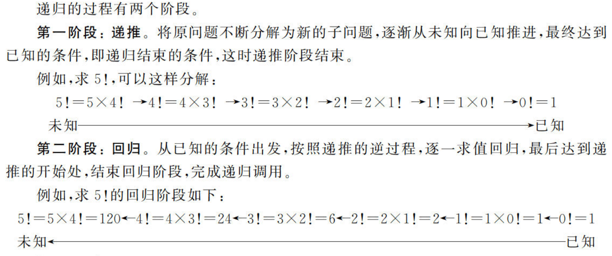
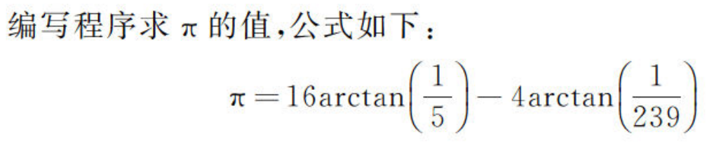
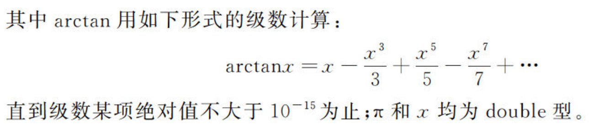
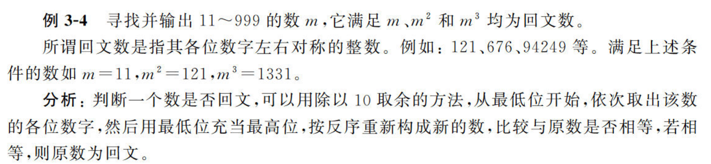

函数是对问题的抽象，在面向对象中是对功能的抽象
## 一、基础知识
### 1.1 形参
函数未调用时，形参不占有实际内存空间，只有在函数被调用时才为形参分配存储单元，并将实参与形参结合。
#### 1.1.1 形参和实参结合的方法有：值传递和引用传递
值传递：函数调用时，用实参来初始化形参，直接单向赋值，此后形参与实参脱离，形参不再影响实参
引用传递：引用可认为是给一个变量的别名，两个变量都操作一个内存地址`int &ri = i`。如果将引用作为形参，在函数调用时形参和实参结合，两者双向连接。
#### 1.1.2 带默认形参值的函数：
函数定义时就预先声明默认的形参值
```cpp
int add(int x=5, int y=6){return x+y;}
void main(){
    add(10,20); //同实参来初始化x,y，输出30
    add(10); //用10初始化x,用默认值6初始化y，输出16
    add(); //x,y都采用默认值，输出11
}

```
两个规则：

1. 默认形参必须在形参列表的最后：按从左到右的顺序进行实参形参结合
2. 同一个作用域内，不允许在同一个函数的多个声明中对默认形参重复定义，即使前后定义相同也不行
```cpp
int add(int x, int y=5, int z=6);//正确
int add(int x=5, int y, int z =6) // 错误，x有默认值，必须放在y前

int add(int x=5, int y=6); //声明函数原型
void main(){
    add();
}
int add(int x=5, int y=6){return x+y;} //错误，这次不能再定义默认值了
```
#### 1.1.3 可变数量形参的函数
使用STL：initializer_list。
```cpp
void print_error(initializer_list<string> ls) { //initializer_list<typename> listname
	for (auto beg = ls.begin(); beg != ls.end(); beg++) {
		cout << *beg << endl;
	}
}
```
### 1.2 递归和嵌套
在function内部调用自己，称为递归。**只有有限次递归有意义（最终可以到已知）**

在function内部调用其他函数，称为嵌套
**递归的逻辑内涵：**
就像数学归纳法，从小的问题不断积累，层层嵌套的关系。
```cpp
void move(char src, char dest) {
	cout << src << "-->" << dest << endl;
}
void hanoi(int n, char src, char medium, char dest) {
	if (n == 1) {
		move(src, dest);
	}
	else {
		hanoi(n - 1, src, dest, medium);
		move(src, dest);
		hanoi(n - 1, medium, src, dest);
	}
}
```

注意：C++不允许在函数内定义函数
### 1.3 内联函数
内联函数在编译时就被替代，而对于其他的函数，都是在运行时候才被替代。这其实就是个空间代价换时间的节省。所以内联函数一般都是1-5行的小函数。在使用内联函数时要留神：

1. 在内联函数内不允许使用循环语句和开关语句；
2. 内联函数的定义必须出现在内联函数第一次调用之前；
3. 类结构中所在的类说明内部定义的函数是内联函数。

### 1.4 函数的重载
重名函数，编译器根据实参和形参的类型与个数的最佳匹配，自动确定调用哪一个函数
重载函数的形参必须有不同：类型不同，数量不同...

## 二、实操
### 2.1 $\pi$的计算：


```cpp
#include <iostream>
using namespace std;

double power(double x, int exponential) {
	double value = 1;
	while (exponential > 0) {
		value *= x;
		exponential--;
	}
	return value;
}

double arctan(double x) {
	double value = 0;
	double add = 1;
	int n = 1;
	int flag = 0;
	double a = 1.e-15;
	do {
		add = power(x, n) / n;
		value = (n%4==1) ? value+add : value-add;
		n += 2;
		flag += 1;
		cout << "the "<< flag <<"round" << value << endl;
	} while (add > a);
	return value;
}

void main() {
	double pi = 0;
	double a = 16.0 * arctan(1 / 5.0);
	double b = 4.0 * arctan(1 / 239.0);
	cout << "PI=" << a - b << endl;
	return;
}
```
### 2.2 回文数：

```cpp
#include <iostream>
using namespace std;


bool palindrome(int n) {
	int i = n;
	int m = 0;
	while (n > 0) {
		m = m * 10 + n % 10;
		n /= 10;
	}
	return i == m;
}

void main() {
	for (int i = 11; i < 1000; i++) {
		if (palindrome(i) && palindrome(i * i) && palindrome(i * i * i)) {
			printf("The number is %d \n", i);
		}
	}
	return;
}
```


