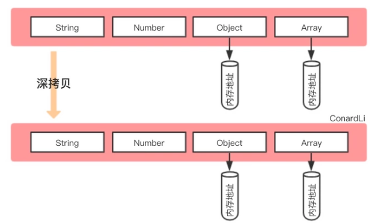

面向对象将客观事物看作具有**属性**和**行为**的对象，对象是一组属性和行为的整体。通过抽象找出同一类对象的共同属性和行为，形成类。

## 一、类与对象
类是对象的抽象，对象是类的实例。
### 1.1 定义类和对象
**定义类：**
```cpp
class 类名 
{
private:
// 私有成员变量和函数
public:
// 公有成员变量和函数
protected：
// 保护成员变量和函数

};
```
private仅能在类的自身访问
public在所有地方都能访问
protected只能在类自身和派生类中访问
如果没有给出控制类型，自动认为是private  
**定义对象：**
`类名 对象名`
### 1.2 成员函数
定义在类内部的函数一律为内联函数（隐式声明），在外部的可以声明为inline（显式声明），也可以像定义为非内联函数。
在类外部定义函数时，要用`类名::函数名`的方式指向类，该符号意为**范围解析**。
### 1.3 构造函数
构造函数用于初始化某些成员变量，在每次对象被创建时调用。构造函数的名称与类相同，不会有返回值。
```cpp
class Line
{
public:
//...
    Line(double h);  // 这是构造函数
private:
    double length;
};
Line::Line(double h)
{
    length = h;
    cout << "Object is being created" << endl;
}
/*等价于
Line::Line(double h):length(h){
    cout << "Object is being created" << endl;
}
*/
int main()
{
    Line line(0); //initializing length
//...
    return 0;
}
```
#### 1.3.1 默认构造函数
如果不显式地定义构造函数，则编译器会隐式地定义一个默认构造函数，默认构造函数的参数列表为空。可以利用函数的重载，同时声明默认构造函数和自定义构造函数。
```cpp
class Clock{
public:
Clock(int newH, int newM, int newS);
//Clock(){ };默认构造函数
}
//调用时
Clock c1(0,0,0); //调用有参数的构造函数
Clock c2; //调用默认构造函数

```
#### 1.3.2 委托构造函数
每次构建一个对象时，只能调用一个特定的构造函数。但利用委托构造函数，可以同时执行多个构造函数功能。在类的继承中，常使用委托构造函数。
#### 1.3.3 复制构造函数
用一个已经存在的对象，去初始化同类的一个新对象  
**调用复制构造函数的情况：**

1. 用类的一个对象去初始化该类的另一个对象
2. 函数的形参是类的对象，进行形参和实参结合时（创建一个新的临时对象）  
   2.1 若使用引用传参就不会调用复制构造函数，因为不产生一个新对象
3. 函数的返回值是类的对象，返回调用者时（函数返回后局部变量消亡，需要一个临时存储空间存储返回的对象）

**为什么要编写复制构造函数：**

1. 只需要对象的部分特征
2. 深复制：新对象和原对象不共享内存




#### 1.3.4移动构造函数：
移动构造函数的本质是将一部分内存转移后销毁，节省了深度复制两倍空间占用。
```cpp
Point::Point(Point&& p) noexcept {
	_a = p._a;
	_b = p._b;
	cout << "move construtor called" << endl;
}

//in main function
Point p1(3,5); // call point default constructor
Point p2(std::move(p1)); // call point move constructor
// std::move will transfer p1 from lvalue to rvalue, and shouldn't be called after converting.

```
### 1.4 析构函数
析构函数用于清理即将被删除的对象，在生命周期结束时被自动调用。析构函数的名称是`~类名`，不接受任何参数，也没有返回值。
### 1.5 default和delete
使用=default可以让编译器自动生成默认或复制构造函数
通过=delete可以将复制构造函数删除，这样类便不会被复制。
```cpp
class MyStr{
public:
	MyStr() = default;				//默认无参构造函数
	MyStr(MyStr &&str) = delete;	//删除移动构造函数
};
```
### 1.6 类的组合与向前引用
类的组合是指**对象与类的组合**，是用一个对象作为其他类的成员
类的组合描述的是一种类与类的**包含关系**
```cpp
class Point{...}
class Line{
public:
	Line(Point xp1, Point xp2); //构造函数，见第8行
private:
	Point p1,p2; //引入Point类的对象，实现类的组合
}
Line::Line(Point xp1, Point xp2):p1(xp1),p2(xp2){...}; //类的组合需要重写构造函数
```
向前引用很鸡肋，就是把类提前声明，但不能使用类里的任何东西，因为尚未被完整定义。基本只能解决相互组合的问题。
### 1.7 UML类图
[【有翻译】10 分钟学会 UML 类图（UML Class Diagram Tutorial）_哔哩哔哩_bilibili](https://www.bilibili.com/video/BV1P741127u7/)
## 二、数据共享与保护
**数据隐藏保护了安全，数据共享却在破坏数据安全。**  
结构化程序设计中的基本单位是函数，通过参数传递和全局变量进行数据共享，但数据和操作混杂，难以进行数据保护。  
对象与对象之间共享：静态成员  
不同类的成员函数之间共享：友元关系  
类与类的保护：访问控制  
数据保护：常量  
### 2.1 作用域与可见性
仅记录局部作用域，其他几个符合常识。
标识符所在的块内（两个`{}`之间），标识符声明后作用
```cpp
void fun(int a){ 	//a在fun整个结构内作用
    int b = a;		//b在fun结构内作用，该语句后作用
    if（b>0){
        int c = 0; 	//c在选择结构内，该语句后作用
    }
}
```
具有包含型作用域的标识符，外层标识符在内层不可见。  
**总结：外层标识符在内层不可见，内层标识符在外层超出作用域。**
### 2.2 静态成员
用于在对象和对象之间共享数据，将数据存储在特定的内存空间，不会随着对象的消亡而消亡。  
声明方式：`static TypeName name`  
在类外访问需要通过`类名::静态数据名/静态函数名()`  
静态成员函数，一般只用来输出静态成员数据，如果想访问非静态成员，需要传入对象参数
```cpp
class Point{
public:
static int count; 				// a static member
int num = 2; 					// a non-static member
static int getcount(Point p); 	// a static function
};
int Point::count = 0; 			// count must be initialized outside class
void Point::getcount(Point p) {
	cout << count++ << endl;
	cout << p.num+count << endl; // static function use non-static data
}
void main() {
	Point p1;
	Point::getcount(p1);
}
```
### 2.3 类的友元(friend)
**在一般函数和类的成员函数之间进行数据共享。**  
用于访问private和prtected的成员  
友元函数：使用friend关键字定义函数  
友元类：若A为B的友元类，则A的所有成员函数都是B的友元函数，都可以访问B的protected和private成员

1. 友元关系不会传递
2. 友元关系是单向的
3. 友元关系是不能被继承的
### 2.4 常量与常对象
**既需要共享，又需要防止改变的数据应该声明为常量。**  
常对象：数据成员值不能改变的对象。常对象必须初始化，而且不能被更新。  
常函数：常函数能修改传入自身的形参，不能改变类中的成员   

1. 常函数只能调用常函数
2. 常函数不能修改一般的数据成员
3. 常对象只能调用常函数，不能调用一般的成员函数（防止数据被修改）
4. const关键字可以区分重载

常数据：常数据，任意函数不能对它赋值
常引用：常引用引用的对象不能被更新


## 三、类的继承
事物与事物之间的一般和特殊关系，父类代表着普遍性，而子类代表着特殊性。  
继承是一般与特殊的关系，组合是整体与部分的关系。
### 3.1 访问控制
#### 公有继承
父类的公有和保护成员的访问属性在派生类中**不变**，父类私有成员不可见（继承了但不能直接访问）
#### 私有继承
父类的公有和保护成员的访问属性在派生类中为**私有成员**，父类私有成员不可见。  
注意：使用私有继承时，至多只能进行一次继承，第二次则使得父类全部成员不可见，失去继承作用。所以私有继承使用较少。
#### 保护继承
父类的公有和保护成员的访问属性在派生类中为**保护成员**，父类私有成员不可见。  
保护继承隔绝了类外使用者（普通函数），又维持了类内的可访问性。
### 3.2 派生类的构造函数和析构函数
构造派生类的对象时，要对基类的成员对象和新增成员对象进行初始化。  
#### 3.2.1 子类构造函数调用顺序为：

1. 父类构造函数，顺序按继承时声明的顺序
2. 对子类新增成员初始化
3. 执行子类构造函数体中的内容
#### 3.2.2 默认构造函数：
如果父类无形参表的构造函数，子类也不需要调用带参数的构造函数，则可使用默认构造函数。
#### 3.2.3 复用父类构造函数：
如果子类没有需要初始化的成员，可以直接`using Base::Base`，复用父类的构造函数。
如果子类有新的成员需要初始化，那么应该写出新的构造函数，在链表初始化阶段调用父类构造函数，然后再补充新成员的初始化。
```cpp
class Point { //父类
public:
	Point(int x, int y);
private:
	int _x, _y;
};
Point::Point(int x, int y) :_x(x), _y(y) {}

class Line : public Point { //子类
public:
	Line(int x, int y, int length);
private:
	int _length;
};
Line::Line(int x, int y,int length) :Point(x, y), _length(length) {} //复用构造函数
```
#### 3.2.4 析构函数：
子类析构函数的调用顺序与构造函数完全相反。
先调用子类的析构函数，再从右向左调用子类继承的类的析构函数。
### 3.3 子类的访问
#### 3.3.1 同名的隐藏规则：
如果子类的多个父类拥有同名的成员，则在子类中构成重载。若在子类中声明了同名函数，则继承的所有同名函数的重载形式都会被隐藏。可以使用`父类名::`的方式访问父类中的同名函数
#### 3.3.2 虚基类：
**解决的问题：**当派生类从多个基类派生，而这些基类又有共同基类，则在访问此共同基类中的成员时，将产生冗余，并有可能因冗余带来不一致性。  
当面临如下情况时，Derived完全来自于Base0，且每个成员会两次被继承到Derived中。实际需要是访问Base0中的var0和fun0，但继承后必须用Base1::或Base2::来访问继承来的。  
所以引入虚基类，在Base1和Base2从Base0继承时使用virtual关键字。这样在Derived中只有一份var0和fun0。


## 四、多态和动态绑定
同样的信息，不同类型的对象接收时导致了不同的行为。支持这种功能的机制就是多态和动态绑定。  
多态的分类：重载多态（函数、运算符），强制多态（类型转换），包含多态（虚函数），参数多态（类模板）  
多态的实现：静态绑定（编译连接时绑定），动态绑定（程序运行阶段绑定）
### 4.1 运算符重载
对已有运算符进行赋予多层含义，使同一个运算符在不同数据表现为不同功能。
#### 4.1.1 哪些能重载：

1. c++内存在的运算符
2. 类属关系`.`，成员指针`.*`，作用域标识符`::`，三目运算符`? :`**不能被重载**
#### 4.1.2 重载后的性质：

1. 优先级和结合性都不变
2. 重载为类的成员函数时，参数个数比之前少一个：  
   2.1 第一个操作数会由调用的对象this指针提供，所以只需要提供第二个。例：对象a,b，a+b，+是A的成员函数，所以a不需要在参数中提供，只需要提供b即可  
   2.2 重载为非成员函数时没有该性质  
#### 4.1.3 重载的要求：

1. 功能应当类似（不应把-重载为加法）
2. 重载的语法：  
   2.1 成员函数：类型就是类名，返回值也是类  
   2.2 非成员函数：友元函数friend  
```cpp
class Complex {
public:
	Complex(double real = 0, double imag = 0) :_real(real), _imag(imag) {}
	Complex operator+(const Complex c2) const;
	void display() const { cout << _real << _imag << endl; };
private:
	double _real;
	double _imag;
};
Complex Complex::operator+(const Complex c2) const {
	return Complex(_real + c2._real, _imag + c2._imag);
}
```
### 4.2 虚函数：
虚函数是动态绑定的基础，虚函数必须是非静态的成员函数。虚函数派生后就可以在类群里实现运行过程中的多态。如果派生类希望改变基类的功能，那么应该在基类中声明函数为虚函数；如果不希望，则不能被声明为虚函数。
#### 4.2.1 语法要求：

1. 在父类中声明函数为虚函数，在子类中需定义同名函数（可以也声明为虚函数，也可以不用）
2. 写函数实现时不能再用virtual，仅声明时可以出现virtual
3. 函数的调用要通过**基类**指针或者引用
#### 4.2.2 final和override
为了防止误操作，可以在子类中定义虚函数时加上override，这样如果并没有实现对父类虚函数的覆盖会报错。如果有哪个函数不希望被覆盖，可以用final
```cpp
class Base1 {					//父类	
public:
	virtual void display();
};
void Base1::display() {
	cout << "Base1 called" << endl;
}

class Base2 : public Base1 {	//子类1
public:
	virtual void display() override;	//表明是覆盖而来的
};
void Base2::display() {
	cout << "Base2 called" << endl;
}

class Base3 : public Base1 {	//子类2
public:
	virtual void display() final;		//表明不允许再覆盖
};
void Base3::display() {
	cout << "Base3 called" << endl;
}

void fun(Base1* base1) {		//用父类指针调用的函数
	base1->display();
}
int main() {
	Base1 base1;
	Base2 base2;
	Base3 base3;

	fun(&base1);	//调用父类  "Base1 called"
	fun(&base2);	//调用子类1 "Base2 called"
	fun(&base3);	//调用子类2 "Base3 called"
	return 0;
}

```
#### 4.2.3 dynamic_cast
dynamic_cast，沿着类的层级结构，安全转换指针或引用。基类必须是动态的，即含有至少一个虚函数。

```cpp
// C++ Program demonstrate if the cast
// fails and new_type is a pointer type
// it returns a null pointer of that type
#include <iostream>
using namespace std;
 
// Base class declaration
class Base {
    virtual void print()
    {
        cout << "Base" << endl;
    }
};
 
// Derived1 class declaration
class Derived1 : public Base {
    void print()
    {
        cout << "Derived1" << endl;
    }
};
 
// Derived2 class declaration
class Derived2 : public Base {
    void print()
    {
        cout << "Derived2" << endl;
    }
};
 
// Driver Code
int main()
{
    Derived1 d1;
    Base* bp = dynamic_cast<Base*>(&d1); //将Derived*类型转化为Base*类型，可调用Base内的成员
 
    // Dynamic Casting
    Derived1* dp2 = dynamic_cast<Derived1*>(bp);
    if (dp2 == nullptr)
        cout << "null" << endl;		//若转换不安全，则产生空指针，这里输出null
    else
        cout<< "not null" << endl;	//最终输出是not null，转换是安全的
    return 0;
}
```

### 4.3 纯虚函数和抽象类
纯虚函数是虚函数末尾加上=0，代表这个函数没有具体实现，只是为了类的功能抽象而写，为了继承后具体实现而写。
含有纯虚函数的类称为抽象类，抽象类不能实例化


## 五、其他：
### 5.1 enum
enum是一个枚举类型，用于重复枚举行为。通过将标识符与值绑定，enum实际功能类似于#define，提前定义好标识符的值。
enum class是scoped enum，将enum声明为一个类，需要通过范围解释`::`才能访问其内部的值。
```cpp
enum Week1 = {MON = 0, TUE, WED, THU, FRI, SAT, SUN}; //declaration
Week1 week1 = MON; //initialization
std::cout<<week1<<std::endl; // output: 0

// Thought the identifiers are used, the enum class divides them.
enum class Week2 = {MON = 0, TUE, WED, THU, FRI, SAT, SUN}
Week2 week2 = Week2::MON; // declare of MON must be in Week2
//week2 can not be printed directly
if (week2 == Week2::MON){std::cout<<"1"<<std::endl;}
```


