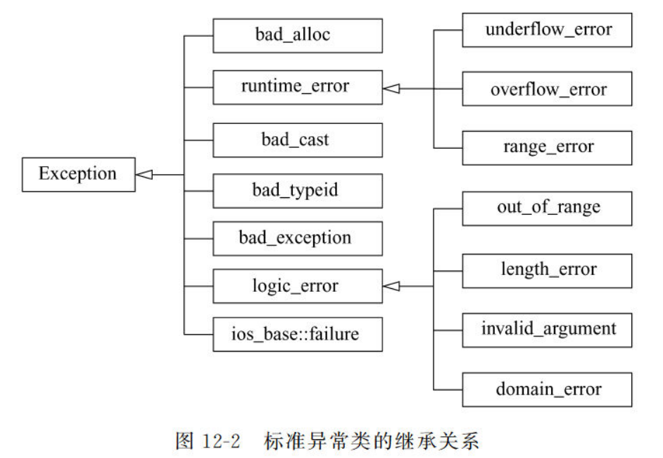
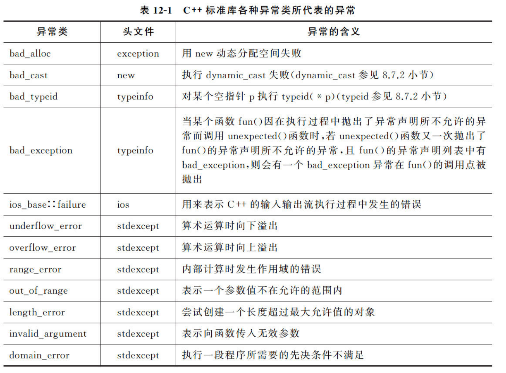

## 一、多文件
### 1.1 一般结构：
1. head：类定义文件（*.h）
2. resource：类实现文件（*.cpp）
3. source：类使用文件（*.cpp，主函数文件）
### 1.2 文件间交互：
#### 1.2.1 #include命令
`#include "文件名"`的方式，将文件名所指的文件包含到当前程序内
#### 1.2.2 外部变量和外部函数
使用其他文件中的变量，用extern关键字声明
```cpp
//file1.cpp
int i = 3;
//file2.cpp
extern int i; //声明一个已经在其他文件中定义的外部变量
i++; //i = 4
```
函数同理
#### 1.2.3 命名空间
将程序库的名称封装起来，相当于在越来越多的的关键字和变量中，建立起围墙，解决重名的问题。
声明：
使用`namespace A{}`即可声明一个命名空间A，与其他命名空间相隔。
命名空间可以嵌套，即在A内可以声明命名空间B，通过多层范围解析即可。
使用：
在命名空间外部使用空间内变量或函数时，可以使用using指令。
```cpp
using namespace A; //引入A中所有成员，可能导致重名引发冲突
using std::cout; //引入std中一个成员，不会重名报错
```

### 1.3 编译预处理

1. 使用#include
2. 使用#define 和#undef  
   2.1 主要功能已被c++新语法取代  
   2.2 目前常用于定义空符号#define MYHEAD_H，与条件编译指令一起使用  
3. 使用#if, #elif, #else  
   3.1 在满足一些条件的时候才参与编译，可以在不同编译条件下产生不同的编译代码。

因为头文件可能会被多个文件以#include方式包含，在编译时出现错误，所以要使用条件编译指令.  
**#pragma once已被引入大多数编译器，成为广泛做法，但仍未成为标准。**
```cpp
//head.h
#ifndef HEAD_H 	//先判断空符号HEAD_H是否被定义过，若已被定义，则不需再次编译头文件。
#define HEAD_H	//若未定义则头文件尚未编译过，开始编译
class ...{
...
    }
#endif
```

## 二、代码的编译、连接与执行过程
### 2.1 编译
编译：经过编译系统的处理，生成目标文件的过程叫做编译。编译对一个个源文件分别处理，编译单元互不影响，每个生成一个目标文件。
目标文件（.o/.obj）：主要描述程序在运行过程中需要放在内存中的内容，包括代码段和数据段。其中，代码段（.txt）将高级语言变为可执行的机器语言。数据段则包括已初始化的数据段（.data），未初始化的（.bss），按其生存期放入不同内存空间。数据段还包含符号表，即标识符与内存地址的关联。
### 2.2 连接
将目标文件之间相互连接，同时将标准库连接，同时按照符号表将标识符与地址对应起来，所有可执行文件都是有效地址。
### 2.3 执行

## 三、异常处理
程序出现错误是可以预料且不可避免地，应该让程序具有容错能力。
### 3.1 异常处理的实现
#### 3.1.1 try, catch, throw语句：
try内执行可能产生异常的语句，如果发生异常则使用throw语句“扔出”错误，然后catch语句按顺序查找与throw相匹配的类型，执行catch内的语句。
```cpp
#include<iostream>
using namespace std;

int divide(int a, int b) {
	if (b == 0) {
		throw a;
	}
	else {
		return a / b;
	}
}

void main() {
	try {
		cout << divide(5, 3) << endl;
		cout << divide(2, 0) << endl;
	}
	catch (int e) {
		cout << e << endl;
	}
}
```
注意：

1. try内没有报错，即没有throw的情况下，会跳过catch的执行
2. 没有与throw类型相匹配的catch时，将返回到函数调用点，重新发出throw，寻找匹配的catch，直到main函数结束执行
3. catch匹配的条件：类型一致/类型的引用/公共基类/公共基类的引用/指针类型且前到后可转换
#### 3.1.2 异常接口声明
未使得程序可读，在函数声明时应声明异常的可能类型。
```cpp
void fun() throw (A,B,C,D); // 只可能返回A,B,C,D四种异常
void fun();					// 可能返回任何异常
void fun throw();			// 不会抛出异常
```
#### 3.1.3 异常处理中的析构
如果程序在try中发生了异常，则程序需要离开try转而到其他函数，所以需要做好结束对象前的清理工作。即按照与构造相反的顺序调用析构函数，清理内存。

### 3.2 标准库异常处理
标准库可以避免内存泄漏，安全处理异常，不破坏容器。




