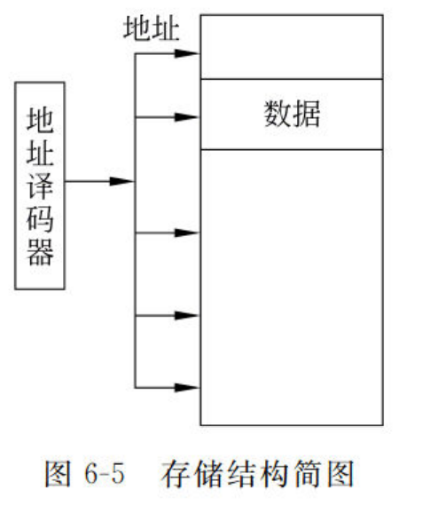
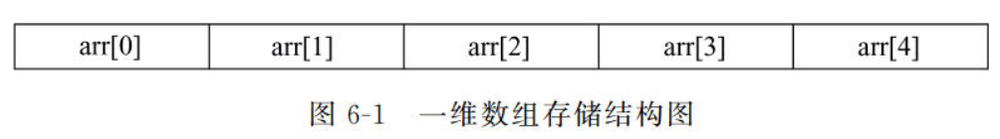
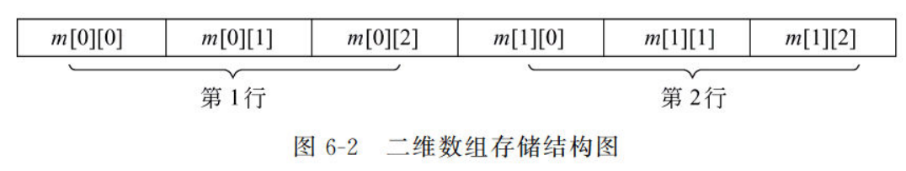

## 一、指针
直接的地址操作手段，可以灵活方便有效地组织和表达复杂数据结构，动态内存分配。
### 1.1 内存访问方式：
存储单元的编号称为地址，存储单元的基本单位是字节1Byte（8bits）
C++通过变量名或地址访问内存。
在不同函数之间传送大量数据时，如果不传递变量的值，只传递变量的地址，就会减少系统开销，提高效率。指针类型变量就是专门用于存放内存地址的变量类型。

### 1.2 指针类型变量
#### 1.2.1 *和&运算符
*称为解析，表示获取指针所指向的变量的值
&称为取地址，用来获得一个对象的地址
#### 1.2.2 基本语法
**指针的声明：**
```c++
int *ptr = &a //指针的声明。这里*不表示解析，只表示定义时的必须。

const int* ptr1 = &a //常量指针，ptr指针不能改变操作改变内存a的值。
int *const ptr2 = &a //指针常量，ptr指针不能改变

void *pv //pv可以指向任何类型，一般在数据类型不确定时使用
```
#### 1.2.3 指针运算
指针是一种数据类型，可以参与运算。运算包括：算数运算，关系运算，赋值运算  
**算数运算：**  
指针p1与整数n1，`p1+n1`表示p1后第n1个数的地址
0指针是一个空指针，`int *ptr = 0`  
**关系运算：**  
若两个指针指向同一个地址，则两个指针相等
其他情况下指针的关系运算没有意义。  
**赋值运算：**  
指针初始化时最好给它赋值，否则它的值指向不确定。没有有效地址时也应让指针指向0。  
#### 1.2.4 指针传参  
当有大量数据在函数间传递时，使用指针只传递其地址可以减小内存开销，同时也能实现参数双向传递。
```c++
//形参写法
int func(int* ptr){
  printf("%d",*ptr); //0
}
//实参写法
int a = 0;
func(&a);
```
#### 1.2.5 函数指针、对象指针
指针可以指向任何东西，指向函数时指向标识符所在内存，调用该标识符即可调用函数。
指向对象的指针通常是希望通过动态内存管理，改变对象的默认生存期。
#### 1.2.6 指针函数
由于c++不能直接返回数组，但可以返回数组的指针。所以定义指针函数，即返回值为指针的函数，使它返回一个数组的地址。其中数组要以`static`形式，否则局部数组在函数调用后会销毁，地址便不再有效。
### 1.3 指针与引用
#### 1.3.1 指针和引用的区别
指针实际上是一种变量类型，存储变量的内存地址，其本身也需求内存空间去存储
引用实际上是一种别名，实质是一种指针常量
指针非常灵活，但操作复杂，而且容易出现野指针，使程序不安全。
引用则较为死板，只能对一个变量起一次别名，但能让程序更安全
#### 1.3.2 指针传递与引用传递
指针传递的本质还是一种值传递，传递进去的是变量的地址，可以对传进去的参数进行任意的操作，但注意是局部变量。
引用传递的本质是对原数据的操作，不能修改引用的地址。
两者都能将传数据变为传数据地址，实现双向修改。但仅完成该目的，引用更安全、更简单。
### 1.4 内存分配
#### 1.4.1 动态内存分配（堆）
在c++程序运行过程中，**由程序员手动**申请和释放的存储单元也成为堆对象。
动态内存分配主要用在**数组分配**上，在不知道数组多大时声明数组可能造成浪费或不足。
new函数：new运算会创建一个指向新分配内存首地址的类型的指针，通过这个指针可以访问堆对象
delete函数：释放指针所指向的内存空间
```cpp
int* ptr = NULL; //先定义一个指向所需变量类型的空指针
ptr = new int[20]; //等需要时再分配ptr所指向的内存大小
delete[] ptr; //删除ptr所指向的数组
```
#### 1.4.2 自动内存分配（栈）
栈的作用是存储局部变量，实现函数调用。栈的内存自动分配回收，局部变量和函数参数存储在栈，一旦变量作用域失效时就会自动出栈，释放存储空间。
#### 1.4.3 静态存储区
static，静态变量与全局变量时相似的，不会随着函数的调用和退出而发生变化。
static修饰类的成员变量和成员函数，可以使其成为类的一部分，而不是对象的一部分。
#### 1.4.4 常量存储区
const，常量定义时必须赋值，常量存储区不允许修改。

## 二、指针与数组
### 2.1 数组的存储


数组是一列连续存储在内存空间中的数据，指针的加减运算恰好适合处理这样的数据。
### 2.2 数组的初始化
静态初始化：02章已记录过
动态初始化：利用动态内存分配，进行数组的初始化
```cpp
int* ptr = new int[n]; //其中，n为一个常数即可
int (*iarray)[b][c] = new int[a]; //高维数组声明方法，最终获得[a][b][c]三维数组
```
### 2.3 数组的遍历
begin和end函数，begin指向数组首元素的指针，end指向数组尾元素的指针。
同时使用begin和end可以方便地遍历数组
```cpp
int array[10] = { 1,2,3,4,5,6,7,8,9,10 }; 					//传统方式遍历
for (int i = 0; i < 10; i++) {
		cout << array[i] << endl;
}
int* ptr = array;
for (int i = 0; i < 10; i++) {								//用指针遍历
	cout << *ptr << endl; 
	ptr++;
}
for (int* bet = begin(array); bet != end(array); bet++) {	//用begin和end遍历
		cout << *bet << endl;	
}
```


